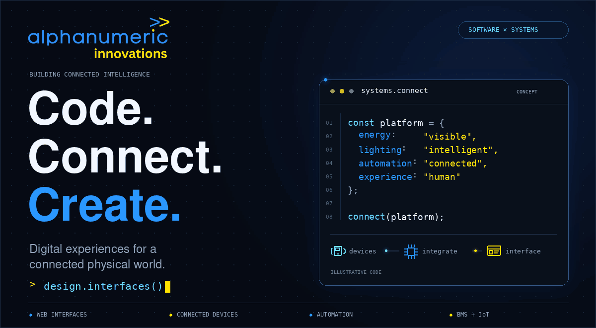
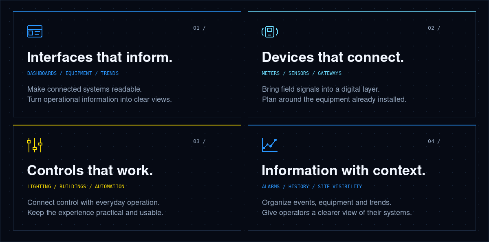
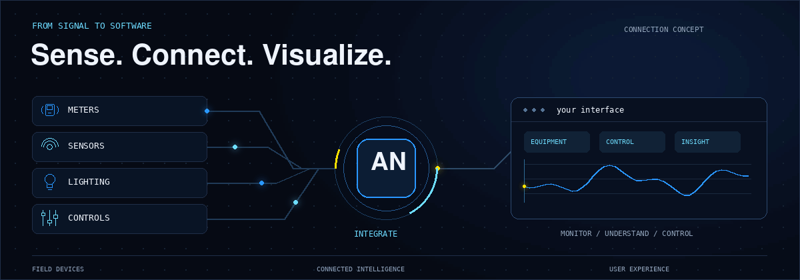
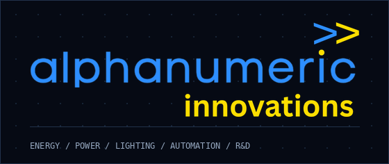
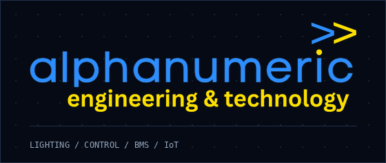
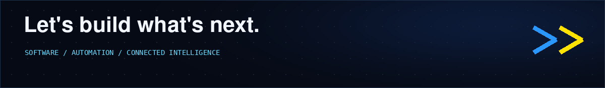

  <a href="https://alphanumericinnovations.com/">
    <picture>
      <source media="(prefers-reduced-motion: reduce) and (max-width: 600px)" srcset="assets/alphanumeric-hero-mobile.png">
      <source media="(prefers-reduced-motion: reduce)" srcset="assets/alphanumeric-hero.png">
      <source media="(max-width: 600px)" srcset="assets/alphanumeric-hero-mobile.gif">
      
    </picture>
  </a>

<h1 align="center">Alpha Numeric</h1>

  <strong>Software interfaces · Connected devices · Intelligent automation</strong> 
  Turning physical systems into meaningful digital experiences.

  
  
  

  <a href="#the-software-layer">About</a> &nbsp;·&nbsp;
  <a href="#what-we-build">Digital focus</a> &nbsp;·&nbsp;
  <a href="#from-signals-to-software">Connected systems</a> &nbsp;·&nbsp;
  <a href="#explore-alpha-numeric">Websites</a> &nbsp;·&nbsp;
  <a href="#lets-build-whats-next">Contact</a>

<h2>The software layer</h2>

The software story starts in the real world. <strong>Alpha Numeric Innovations</strong> brings IoT integration, dashboards and automation together around energy, lighting and building systems.

Our digital focus is on making connected equipment easier to understand and operate: clear interfaces, useful monitoring, historical trends and the right information in the right view.

<strong>AlphaNumeric Engineering &amp; Technology</strong> brings that direction into lighting, automation and BMS/IoT solutions for connected environments. We combine technology selection, system integration and practical project delivery from our base in <strong>Hyderabad, India</strong>.

<h2>What we build</h2>

  <picture>
    <source media="(max-width: 600px)" srcset="assets/software-capabilities-mobile.png">
    
  </picture>

<table>
  <thead>
    <tr><th>Digital focus</th><th>What it brings into view</th></tr>
  </thead>
  <tbody>
    <tr><td><strong>Monitoring &amp; visualization</strong></td><td>Equipment status, energy information, alarms and operating trends.</td></tr>
    <tr><td><strong>Device integration</strong></td><td>Sensors, meters, gateways and supported building-system interfaces.</td></tr>
    <tr><td><strong>Automation &amp; control</strong></td><td>Connected lighting, HVAC and other building services within the project scope.</td></tr>
    <tr><td><strong>BMS modernization</strong></td><td>IoT extensions and remote insight around an existing building management system.</td></tr>
  </tbody>
</table>

<h2>From signals to software</h2>

  <picture>
    <source media="(prefers-reduced-motion: reduce) and (max-width: 600px)" srcset="assets/connected-software-mobile.png">
    <source media="(prefers-reduced-motion: reduce)" srcset="assets/connected-software.png">
    <source media="(max-width: 600px)" srcset="assets/connected-software-mobile.gif">
    
  </picture>

Field devices provide signals. Integration brings them together. Software gives people an understandable view of equipment, events and operation.

The integration path is designed around the installed systems, available interfaces and actual project requirements.

  Branded concept visuals · Illustrative code and interfaces 
  <a href="assets/alphanumeric-hero.png">Still hero</a> &nbsp;·&nbsp;
  <a href="assets/connected-software.png">Still connection visual</a>

  
<strong>Explore the wider solution portfolio</strong>

   
  <table>
    <thead>
      <tr><th>Area</th><th>Focus</th></tr>
    </thead>
    <tbody>
      <tr><td><strong>Energy &amp; power</strong></td><td>Solar energy, electrical infrastructure, distribution, panels and switchgear.</td></tr>
      <tr><td><strong>Lighting</strong></td><td>Residential, commercial, industrial, façade, landscape and outdoor environments.</td></tr>
      <tr><td><strong>Automation</strong></td><td>Homes, workplaces, industrial facilities, hospitality and healthcare spaces.</td></tr>
      <tr><td><strong>BMS &amp; IoT</strong></td><td>Connected building systems, integration, gateways and operational visibility.</td></tr>
      <tr><td><strong>Innovation</strong></td><td>Smart poles, smart bollards and other product development initiatives.</td></tr>
    </tbody>
  </table>

<h2>Explore Alpha Numeric</h2>

<table>
  <tbody>
    <tr>
      <td align="center" width="50%">
        
        
<a href="https://alphanumericinnovations.com/"><strong>Explore Innovations →</strong></a>

      </td>
      <td align="center" width="50%">
        
        
<a href="https://alphanumericet.com/"><strong>Explore Engineering &amp; Technology →</strong></a>

      </td>
    </tr>
  </tbody>
</table>

<h2>Our approach</h2>

<strong>Understand → Design → Integrate → Validate → Support</strong>

Start with the actual requirement. Select compatible technology. Connect the systems carefully. Test the result. Plan for ongoing operation and future expansion.

  
<strong>For developers and collaborators</strong>

  
This repository is our company profile. Each individual project should document its own setup, dependencies, architecture, configuration and release instructions.

  
For collaboration and project enquiries, contact us through the official channels below.

<h2>Let's build what's next</h2>

  

<table>
  <thead>
    <tr><th>Channel</th><th>Connect with us</th></tr>
  </thead>
  <tbody>
    <tr><td><strong>Email</strong></td><td><a href="mailto:info@aniplgroup.com">info@aniplgroup.com</a></td></tr>
    <tr><td><strong>Location</strong></td><td>Mega Hills, Madhapur, Hyderabad, Telangana 500081, India</td></tr>
    <tr><td><strong>Innovations</strong></td><td><a href="https://alphanumericinnovations.com/">alphanumericinnovations.com</a></td></tr>
    <tr><td><strong>Engineering &amp; Technology</strong></td><td><a href="https://alphanumericet.com/">alphanumericet.com</a></td></tr>
    <tr><td><strong>Project enquiries</strong></td><td><a href="https://alphanumericinnovations.com/contact.html">Start a conversation</a> · <a href="https://alphanumericet.com/contact.html">Engineering &amp; Technology enquiries</a></td></tr>
  </tbody>
</table>

  <strong>Alpha Numeric</strong> · Code. Connect. Create.

